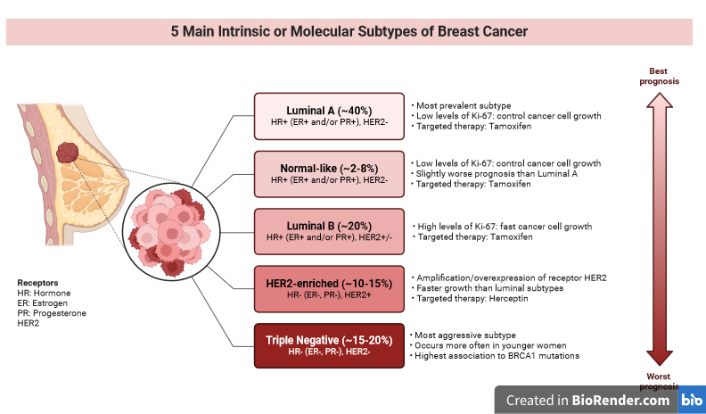

# Drug resistance in cancer: A critical concern

## Introduction
Drug resistance is a major obstacle in cancer treatment often leading to failure of treatment and progression. As cancer cells grow, they develop mechanisms to evade chemotherapeutic treatments and agents making it difficult to develop drugs to target the cancer cells, find and treat them.
One primary mechanism of drug resistance is genetic mutations that alter drug targets. For instance, mutations in the ESR1 gene in breast cancer commonly associated with resistance to endocrine therapies such as aromatase and inhibitors such as tamoxifen respectively. These mutations prevent the drug from binding effectively, reducing its efficacy. Another mechanism is the overexpression of drug efflux pumps, like P-glycoprotein, which actively transport drugs out of cancer cells, lowering the intracellular concentration and diminishing the drug's effects.
The tumor microenvironment also plays a vital role in drug resistance. Hypoxic conditions in solid tumors can activate survival pathways that promote resistance to apoptosis, a process targeted by many chemotherapeutic agents. Additionally, interactions between cancer cells and stromal cells in the tumor microenvironment can lead to the secretion of growth factors and cytokines that protect cancer cells from chemotherapy.
To combat drug resistance, researchers are exploring several strategies. One approach is developing second-generation drugs designed to target resistant cancer cells. For example, Elacestrant (RAD1901) and Alpelisib (Piqray) are effective against certain receptors and pathways such as oestrogen and PI3K pathway respectively. Another strategy is combination therapy, where multiple drugs with different mechanisms of action are used simultaneously, reducing the likelihood that cancer cells will develop resistance to all agents involved.

## Conclusion
In conclusion, drug resistance in cancer is a major challenge that complicates treatment and reduces patient survival. By understanding the mechanisms of resistance and developing new therapeutic strategies, the medical community can improve the effectiveness of cancer treatment and offer hope to patients facing resistant disease. Continued research and innovation are essential to overcoming this critical challenge in oncology.

## References

1.	_Kumar_, _R_., & _Kim_, D. J. (2019). Case studies on overcoming drug resistance in metastatic breast cancer. Case Reports in Oncology, 12(2), 345-353.
2.	_Li_, _J_., & _Zhang_, M. (2021). Targeting drug resistance in breast cancer: Recent advances and future directions. Cancer Research, 81(7), 1756-1768.
3.	_Narasimhan_, _V_., & _Arora_, A. (2022). Clinical implications of drug resistance in breast cancer: Insights from recent trials. Journal of Clinical Oncology, 40(15), 1763-1773.
